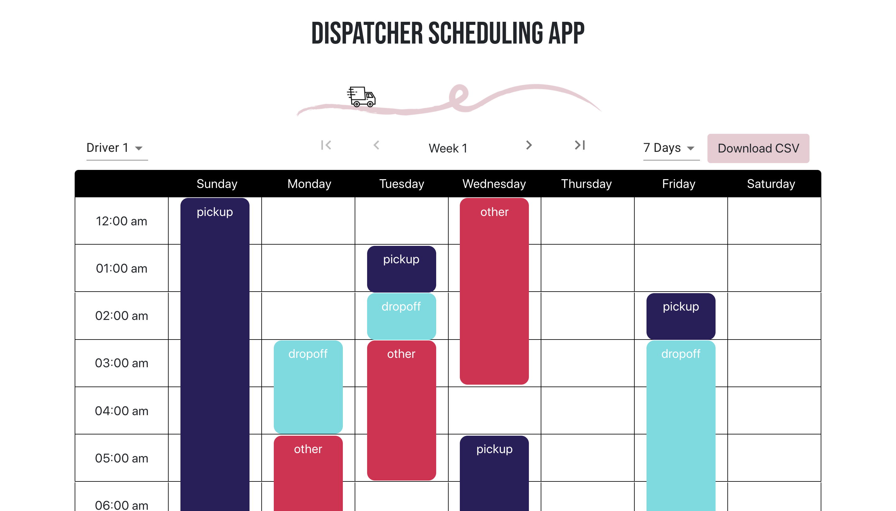
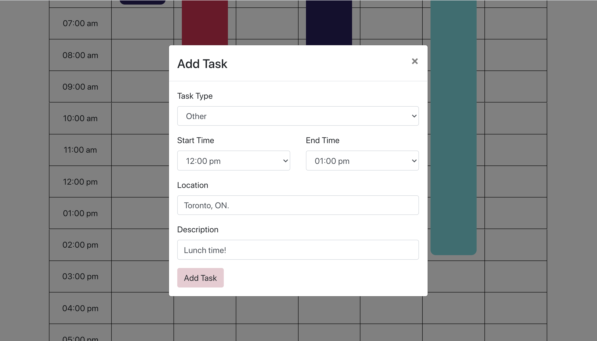

# Dispatcher Scheduling App

## Features
- View a weekly calendar for 3 different drivers
- Create tasks for a specific driver
- Edit existing tasks and update the task type, time, location, and description
- Overwrite old tasks with a conflicting task
- Delete tasks
- Download a CSV file outlining a specific driver's tasks for a chosen time frame

## Getting Started

- `git clone` this repo to your local machine

In the project directory:
- `npm install` to install all dependencies
- `npm start` to run the app
- Open [http://localhost:3000](http://localhost:3000) to view it in the browser

## Dependencies
- @material-ui/core v.4.11.0
- @material-ui/icons v.4.9.1
- bootstrap v.4.5.0
- react-bootstrap v.1.3.0
- lodash v.4.17.1
- moment v.2.27.0
- moment-range v.4.0.2
- react v.16.13.1
- react-csv v.2.0.3
- react-dom v.16.13.1
- react-moment v.0.9.7
- react-scripts v.3.4.1
- uuid v.8.2.0

## Final Product

